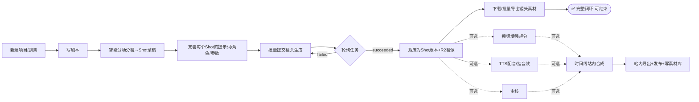

# 漫剧工坊 ManjuStudio · 产品需求文档（PRD）

> 一个开源、可一键部署到 Cloudflare 的 **AI 漫剧创作与协作管理系统**，面向小团队。
> 在「火山方舟 Seedance / 即梦」视频生成能力之上，提供从剧本 → 分镜 → 角色 → 镜头生成 → 配音 → 合成 → 发布的全流程协作，并内置用户、权限、操作日志与计费体系。

- 文档版本：v0.1（draft）
- 更新日期：2026-06-08
- 关联代码库：`seedance-app/`（现有火山方舟视频生成原型，作为生成引擎的事实基础）
- 关联技术文档：[`TECH_DESIGN.md`](./TECH_DESIGN.md)

---

## 1. 背景与目标

### 1.1 背景

「漫剧」是以漫画/插画美术风格驱动的短篇连续剧，制作流程高度依赖 AI 文生图、图生视频、TTS 配音等能力。现有 `seedance-app` 已经打通了火山方舟的核心生成链路：

- **视频生成**：通过 Ark `content_generation.tasks.create / get` 调用 Seedance 系列模型，支持参考图、参考视频、参考音频、公众人物资产（角色一致性）。
- **提示词结构化**：已内置漫剧化的提示词字段——画面（visual）、对话（dialogue）、旁白（voiceover）、音效（soundEffects）、机位（cameraPosition）、运镜（cameraMovement）。
- **视频增强**：通过火山 CV MediaKit `SubmitVideoEnhanceTask` 做超分/增强。
- **素材库**：通过 TOS 对象存储管理图片/视频/音频素材。

但它是**单机、无登录、无协作、Key 明文存前端、任务存内存**的原型，无法支撑团队生产。本项目将其重构为一个**可协作、可治理、可计费、可一键部署**的开源系统。

### 1.2 产品目标

| 目标 | 说明 | 成功度量 |
|---|---|---|
| 漫剧全流程协作 | 剧本→分镜→角色→生成→配音→合成→发布在一个工作台完成 | 一部 ≤10 分钟漫剧可在系统内端到端产出 |
| 降低协作门槛 | 多人按角色分工、实时看到彼此进度 | 5 人团队并行无冲突 |
| 治理与可控 | 谁做了什么、花了多少钱，可审计可限额 | 100% 写操作可追溯；超额自动拦截 |
| 极简部署 | 一键部署到 Cloudflare，零自建服务器 | `一键部署` 按钮 + 一条 wrangler 命令上线 |
| 开源可扩展 | 生成引擎可插拔（火山为首个 Provider） | 新增一个视频 Provider ≤1 个适配文件 |

### 1.3 非目标（本期不做）

- 专业级非线性视频剪辑（仅做镜头级时间线拼接与导出，不做帧级特效）。
- 移动端原生 App（响应式 Web 优先）。
- 公网 SaaS 多租户计费结算/发票（仅做团队内积分制计费与用量统计）。
- 自研大模型与自建推理（统一走第三方 Provider API）。

---

## 2. 目标用户与角色

### 2.1 用户画像

- **小型漫剧工作室 / MCN 内容组（2–15 人）**：需要分工协作、控制 AI 成本、沉淀素材与角色资产。
- **独立创作者**：单人也能用，作为个人创作管理台。
- **外包/兼职协作者**：临时加入某个项目，只需受限权限。

### 2.2 业务角色（System Roles，作用于工作空间）

| 角色 | 中文 | 典型职责 | 权限概要 |
|---|---|---|---|
| Owner | 拥有者 | 创建工作空间、绑定 Key、充值/设定预算 | 全部权限（含计费、删除空间） |
| Admin | 管理员 | 成员管理、权限分配、配额设定 | 除删除空间/转让外全部 |
| Director | 导演/制片 | 立项、把控分镜与终审、分配任务 | 项目级全部 + 审核发布 |
| Creator | 创作者 | 写剧本、做分镜、跑生成、配音 | 创作类读写，受配额约束 |
| Reviewer | 审核 | 评审镜头与成片、批注、打回 | 读 + 评论 + 审核状态变更 |
| Viewer | 观察者 | 只读查看进度与成片 | 只读 |

> 角色是**工作空间级 + 项目级**双层：成员在工作空间有一个基础角色，可在单个项目内被授予更高/更低角色（覆盖）。详见技术文档 RBAC 章节。

---

## 3. 核心概念与信息架构

```
Team（工作空间，租户边界）
 └─ Member（成员，含角色）
 └─ Wallet（积分钱包）/ Budget（预算）
 └─ ProviderCredential（火山 AK/SK/APIKey，加密存储）
 └─ Project（漫剧作品/剧集系列）
     ├─ Character（角色资产：设定 + 参考图 + 一致性资产ID）
     ├─ Episode（单集）
     │   └─ Script（剧本：分场 Scene）
     │       └─ Scene（场）
     │           └─ Shot（镜头：分镜的最小单位）★ 核心创作单元
     │               ├─ Prompt（结构化提示词：画面/对话/旁白/音效/机位/运镜）
     │               ├─ Keyframe（关键帧图，可文生图/上传）
     │               ├─ GenerationTask（图生视频/文生视频任务）
     │               ├─ AudioTrack（配音/音效/BGM）
     │               └─ Version（产出版本，可回溯）
     │   └─ Timeline（镜头排序与合成配置）
     └─ AssetLibrary（素材库：图/视频/音频，R2 + 可选 TOS）
 └─ AuditLog（操作日志）
 └─ Usage / CreditTransaction（用量与计费流水）
```

**Shot（镜头）是系统的核心对象**——一切生成、配音、计费、审核都围绕镜头展开。

---

## 4. 功能需求

### 4.0 流程理念：核心主线 + 可选增值（重要）

系统**不强制绑定**完整流水线。生成出镜头视频后，**「下载成片素材」本身就是一个完整、可结束的流程**——很多省成本的小团队会把生成好的镜头下载下来，用传统剪辑工具（剪映/PR/达芬奇等）自行合成，到这一步流程即告完成。

因此：

- **核心主线（必经，P0）**：项目/剧集 → 剧本（可外部/手动）→ 分镜 → 镜头生成 → 下载/导出素材。走到这里即可视为一次有效产出闭环。
- **AI 能力全部可插拔且相互独立**：剧本/分镜文案的 **LLM**、镜头生成的**视频模型**、配音的 **TTS** 是三类独立 Provider，各自可选可换。火山只是「视频生成」这一类的首个实现；剧本完全可以在更强的外部 LLM 上完成后导入，**不与火山或任何站内 AI 强绑定**。
- **可选增值模块（要开发，但流程上解耦，不前置依赖，P0/P1）**：站内 LLM 辅助写作/分镜、角色一致性、视频增强、配音/音频、时间线合成、协作审核。任一模块都可单独启用或跳过，**不构成主线的强制前置**。
- 任意 Shot 在「已生成」后即可单独下载，或批量打包导出本集所有镜头（zip / 资源清单），无需先配音或合成。
- 审核、配音、合成只是「锦上添花」的可选节点：开了就走、不开就跳过，系统不因为缺这些步骤而阻断导出或标记项目未完成。

> 设计约束：状态机与权限不得把「配音/合成/审核」设为「导出/完成」的硬前置条件（详见技术文档状态机）。

### 4.1 创作主线（P0）

#### F1 项目与剧集管理
- 创建/归档/删除漫剧项目；项目含封面、简介、画风标签、目标分辨率/比例/时长基准。
- 项目下管理多集（Episode），集内有状态：草稿 / 制作中 / 待审 / 已发布。
- 看板视图（按状态）与列表视图（TanStack Table，可排序/筛选/分页，对应火山「查询任务列表」分页能力）。

#### F2 剧本与分场（Script & Scene）· LLM 不强绑定
> 剧本创作不绑定任何单一大模型。火山当前强在**视频生成**，而剧本/分镜文案可能在别的 LLM 上效果更好——因此剧本环节支持三种并行路径，团队自由选择：
- **路径 A · 手动/外部撰写（主路径，零依赖）**：在本平台直接用富文本/Markdown 写剧本；或在外部任意平台（ChatGPT/Claude/Gemini/豆包等）写好后**复制粘贴 / 导入（txt/md/json）**进来。不调用任何站内 AI 即可继续后续分镜与生成。
- **路径 B · 站内可插拔 LLM 辅助（可选）**：在本平台一键「智能分场/分镜」（把剧本拆为 Scene→Shot 草稿、扩写画面提示词、生成对白），底层走**可插拔的 LLM Provider**——团队可在设置中选择/配置使用哪个 LLM（火山豆包、OpenAI、Claude、自建兼容 OpenAI 协议的端点等），与视频 Provider 相互独立。
- **路径 C · 结构化直接导入**：支持直接导入已是分镜结构的 JSON（Scene/Shot + 提示词字段），跳过剧本与拆分步骤。
- 每个 Scene 含：场景描述、时间地点、出场角色、情绪基调。
- 约束：分镜表的提示词字段（画面/对话/旁白/音效/机位/运镜）**永远可手填可编辑**，LLM 仅为加速，不是必经。

#### F3 分镜表（Storyboard / Shot List）★
- Shot 为表格 + 卡片双视图。每个 Shot 字段（沿用并扩展 `seedance-app` 的 `PromptFields`）：
  - 画面提示词 visual、对话 dialogue、旁白 voiceover、音效 soundEffects、机位 cameraPosition、运镜 cameraMovement
  - 时长 duration、比例 ratio、分辨率 resolution、关联角色、关键帧图、参考素材
- 支持拖拽排序、复制、批量改参数、批量提交生成。
- Shot 状态机：待生成 → 生成中 → 已生成 → 待审 → 通过 / 打回 → 已配音 → 已合成。

#### F4 角色资产与一致性（Characters）
- 角色卡：姓名、设定、外观描述、参考图集、声音模板（TTS 音色）。
- **一致性策略**：保存参考图集与「公众人物/角色资产 ID（`asset://...`）」，生成镜头时自动注入为 `reference_image`（对应现有 `public_figure_asset_id` 与 `reference_images` 能力）。
- 角色复用：跨集、跨镜头一键引用。

#### F5 镜头生成（Generation）★
- 支持：文生视频、图生视频（关键帧→视频）、文生图（生成关键帧）。
- 参数面板：模型选择（Seedance 2.0 / 2.0-fast / 自定义 endpoint）、分辨率、比例、时长、是否生成音频、是否联网检索、水印开关、参考图/视频/音频。
- 提交后创建 `GenerationTask`，异步轮询火山任务状态（queued/running/succeeded/failed），实时进度回显。
- **任务中心**：聚合展示某项目/某集/某成员的全部生成任务（对应火山「查询视频生成任务列表」API：按状态、模型、时间分页过滤）。
- 失败可一键重试；成功产物自动落库为 Shot 的一个 Version，并镜像存储到 R2。
- **下载/导出（主线终点之一）**：任一已生成镜头可直接下载原视频；支持「批量导出本集所有镜头」（zip + 资源清单 JSON，含提示词/参数/角色映射），供团队拿到外部剪辑工具自行合成。**到此即为一次完整产出，无需任何后续步骤。**

#### F6 视频增强（Enhance）· 可选模块
- 对已生成镜头一键超分/增强（对应 `SubmitVideoEnhanceTask` / `GetVideoEnhanceTask`），可选目标分辨率与增强模式（standard/professional/ai_model）。

#### F7 配音与音频（Audio）· 可选模块（解耦，不前置依赖）
- 对话/旁白一键 TTS（火山语音合成 Provider），按角色音色映射。
- 音效与 BGM 从素材库挂载。
- 音视频对齐：在镜头级别绑定音轨。
- **可跳过**：团队可选择不在系统内配音，直接导出无声/含生成音的镜头，自行在外部处理。

#### F8 时间线与合成（Timeline & Export）· 可选模块（解耦，不前置依赖）
- 将一集内的镜头按顺序排入时间线，配置转场、音轨；**不要求镜头先经过审核或配音**。
- 站内合成导出成片（MP4），写入素材库与发布记录。（合成方式见技术文档：优先服务端拼接/转码方案选型。）
- **可跳过**：默认路径是「下载镜头素材到外部剪辑工具合成」；站内合成仅面向希望一站式完成的团队，是增值而非必经。

#### F9 素材库（Asset Library）
- 图/视频/音频统一管理，标签/搜索/预览/去重。
- 存储：默认 Cloudflare R2；可选继续使用火山 TOS（兼容现有实现）。
- 上传限额与类型校验。

#### F10 协作（Collaboration）
- 镜头/成片级评论与 @提及、批注。
- 任务分配（把某些 Shot 指派给某成员）。
- 变更通知（站内 + 可选 Webhook/邮件）。
- 乐观锁/版本，避免并发覆盖。

### 4.2 用户系统（P0）

#### F11 认证（Auth）
- 邮箱 + 密码登录、注册（可关闭开放注册，仅邀请制）。
- 邀请链接加入工作空间（带角色预设、有效期）。
- 可选第三方登录（GitHub OAuth）。
- 基于服务端 Session（Cookie，HttpOnly + Secure），支持登出与会话失效。
- 找回密码、修改密码、二次确认敏感操作。

#### F12 角色与权限（RBAC）
- 工作空间级基础角色 + 项目级角色覆盖（见 §2.2）。
- 细粒度权限点（如 `shot.generate`、`billing.manage`、`member.invite`、`credential.write`），角色映射到权限集合。
- 后端**强制**鉴权（前端隐藏仅为体验，权限以服务端为准）。

#### F13 操作日志 / 审计（Audit Log）
- 记录所有写操作：actor、time、action、目标对象、前后差异摘要、IP/UA、来源（Web/API）。
- 关键事件强制记录：登录/登出、权限变更、Key 读写、生成提交、计费扣减、删除类操作。
- 提供筛选（按人/对象/动作/时间）与导出（CSV）。日志**只追加、不可篡改**（应用层不提供删除接口）。

#### F14 计费与配额（Billing & Quota）
- **积分制（Credits）**：团队钱包持有积分；每次 AI 调用按「模型 × 分辨率 × 时长 × 数量」换算消耗积分（计费规则可配置，映射火山实际计费维度）。
- **预扣 + 结算**：提交任务时按预估预扣，任务失败自动退回，成功按实际结算。
- **配额/预算**：可为工作空间、项目、成员设置日/月用量上限；超限拦截或转入审批。
- **用量报表**：按成员/项目/模型/时间维度统计消耗与成本，导出 CSV。
- 充值（手动调整积分；本期不接支付网关，仅 Owner 可增减并留审计）。

### 4.3 系统与运维（P1）

- F15 工作空间设置：品牌、默认生成参数、计费规则、Provider 凭据管理（加密，仅 Owner/Admin 可写，永不下发明文）。
- F16 通知中心：任务完成/失败、审核结果、配额预警。
- F17 数据导出/备份：项目、剧本、分镜导出 JSON。
- F18 健康看板：任务成功率、平均时长、积分消耗趋势。

---

## 5. 关键用户流程

### 5.1 端到端创作流（Happy Path）



> 实线为**核心主线**：生成后「下载/导出素材」即完成一次有效产出。虚线为**可选增值模块**（增强/配音/审核/合成），可任意启用或全部跳过，互不强制前置。

每一步的**写操作**都会：① 校验 RBAC 权限 ② 预扣/结算积分（涉及 AI 调用时）③ 落审计日志。

### 5.2 成员协作流

Owner 创建空间并绑定火山 Key → 邀请成员并设角色 → Director 立项分配 Shot → Creator 领取并生成 → Reviewer 审核 → Director 终审发布。配额由 Admin 设定，超额由系统拦截并提示申请提额。

---

## 6. 非功能需求（NFR）

| 维度 | 要求 |
|---|---|
| 部署 | 一键部署到 Cloudflare（Pages 静态 + Workers/Pages Functions + D1 + R2 + Queues + Cron），无需自建服务器 |
| 技术栈 | 全 TypeScript；前端 TanStack（Router/Query/Table/Form，可选 Start）+ Base UI；后端 Workers + Hono + Drizzle |
| 性能 | 列表/看板首屏 < 1.5s（边缘缓存）；任务状态轮询对前端无阻塞（Query 轮询 + Queue 后台拉取） |
| 安全 | Provider 凭据加密落库、永不下发；Session HttpOnly/Secure；CSRF 防护；后端强制鉴权；审计不可篡改 |
| 可用性 | 边缘多区域；D1 单库（小团队足够），任务轮询幂等可恢复 |
| 可扩展 | Provider 适配层（火山为首），生成/增强/TTS 三类能力均为接口抽象 |
| 可观测 | 结构化日志 + 任务成功率/耗时/消耗看板 |
| 国际化 | 文案中文优先，预留 i18n 结构 |
| 开源 | MIT/Apache-2.0；含一键部署按钮、示例 `.env`、迁移脚本与种子数据 |

---

## 7. 里程碑（建议）

| 阶段 | 范围 | 产出 |
|---|---|---|
| M0 脚手架 | 单仓库、TanStack+Base UI、Workers+D1+Drizzle、Cloudflare 一键部署跑通 | 可登录的空壳 |
| M1 创作主线 | F1–F3、F5（生成+任务中心）、F9 素材库（R2） | 能从分镜跑出镜头视频 |
| M2 用户系统 | F11–F14（Auth/RBAC/审计/计费） | 多人协作 + 可计费可审计 |
| M3 完善 | F4 角色一致性、F6 增强、F7 配音、F8 合成导出、F10 协作 | 端到端成片 |
| M4 运维与开源 | F15–F18、文档、一键部署按钮、Demo 数据 | 可对外开源发布 |

---

## 8. 风险与对策

| 风险 | 对策 |
|---|---|
| 火山任务异步、回调不稳定 | Cloudflare Cron + Queues 主动轮询，任务状态幂等更新，超时重试与告警 |
| 视频合成在 Workers 上算力受限 | 合成走「服务端转码服务/外部 ffmpeg Worker 容器」或 Provider 合成能力；MVP 先做镜头列表导出 + 客户端预览 |
| Provider Key 泄露 | 加密存储（Workers Secret + 应用层加密），仅服务端使用，前端永不接触；审计 Key 读写 |
| 计费与火山真实账单偏差 | 计费规则可配置 + 用量与火山「任务列表」对账；预扣/退款机制 |
| D1 写入与并发限制 | 高频状态更新走 KV/Queue 聚合后批量入库；审计/用量异步写 |

---

## 9. 验收标准（MVP）

1. Owner 可一键部署上线并完成首登录，绑定火山 Key（加密存储，前端不可见）。
2. 5 人团队按不同角色协作，权限边界生效（越权被服务端拒绝）。
3. **主线闭环**：从剧本→分镜→批量生成→下载/批量导出镜头素材，即可完成一次有效产出（不依赖配音/合成/审核）。
3b. **可选增值**：增强、配音、站内合成、审核四个模块各自可独立启用并跑通，且任一模块跳过都不阻断导出。
4. 每一次 AI 生成都有：积分预扣/结算流水 + 审计日志 + 任务中心可见（支持按状态/模型分页查询）。
5. 配额超限被拦截；用量报表与流水可导出 CSV。
