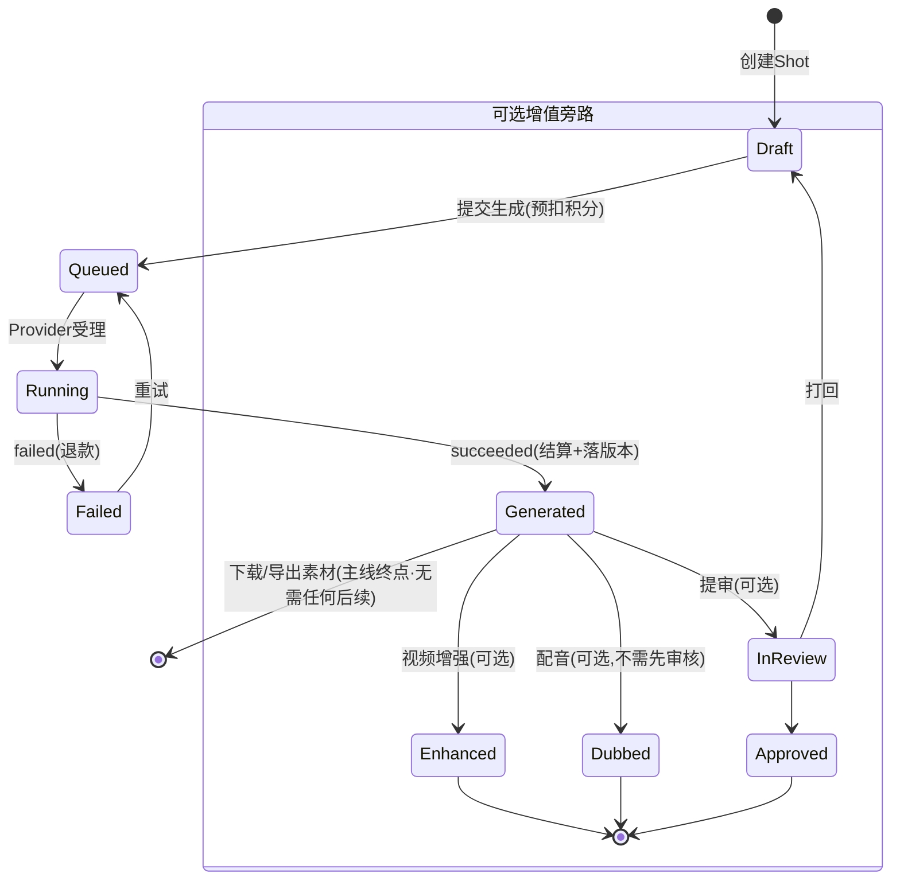
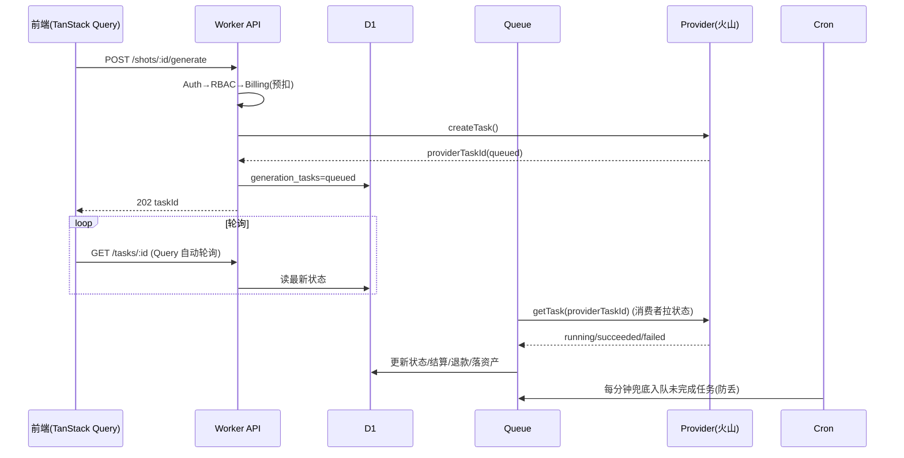

# 漫剧工坊 ManjuStudio · 技术设计文档（Technical Design）

- 文档版本：v0.1（draft）
- 更新日期：2026-06-08
- 关联文档：[`PRD.md`](./PRD.md)
- 设计原则：**全 TypeScript、边缘优先（Cloudflare）、Provider 可插拔、后端强制鉴权、所有写操作可计费可审计。**

---

## 1. 技术选型总览

| 层 | 选型 | 说明 |
|---|---|---|
| 语言 | **TypeScript**（前后端统一） | 共享类型，端到端类型安全 |
| 前端框架 | **TanStack Start**（React 19 + Vite）或 TanStack Router + Vite SPA | Start 提供 SSR/Server Functions，可直接部署到 Cloudflare |
| 路由 | **TanStack Router**（文件式、类型安全） | 路由级 loader 与权限守卫 |
| 数据请求 | **TanStack Query** | 缓存、轮询任务状态、乐观更新 |
| 表格 | **TanStack Table** | 分镜表、任务中心、用量报表、审计日志 |
| 表单 | **TanStack Form** + **Zod** | 提示词/参数表单校验 |
| UI 组件 | **Base UI**（base-ui.com，无样式可访问性组件） | 配合 Tailwind/CSS 自定义主题 |
| 后端运行时 | **Cloudflare Workers**（Pages Functions 同源） | 边缘函数，承载 API |
| Web 框架 | **Hono** | 轻量、Workers 原生、中间件生态 |
| ORM | **Drizzle ORM** | 类型安全、D1 适配、迁移工具 |
| 关系库 | **Cloudflare D1**（SQLite） | 业务主数据 |
| 对象存储 | **Cloudflare R2**（默认）/ 火山 TOS（兼容） | 素材、生成产物镜像 |
| 缓存/会话 | **Cloudflare KV** | Session、热点缓存、任务状态聚合 |
| 异步队列 | **Cloudflare Queues** | 生成任务轮询、计费结算、审计写入 |
| 定时 | **Cloudflare Cron Triggers** | 兜底轮询火山任务、对账、配额重置 |
| 鉴权 | 自建 Session（Cookie）+ RBAC 中间件 | 或集成 better-auth（D1 适配） |
| 校验 | **Zod**（前后端共享 schema） | 输入校验 + 类型推导 |
| 部署 | **Wrangler** + 一键部署按钮 | 见 §11 |

> 选型说明：用户要求 Pages + D1 + Workers。在 Cloudflare 新模型下，**Pages Functions 即 Workers**，TanStack Start 的 server 产物可作为 Worker 运行，静态资源由 Pages/Workers Assets 托管。下文统称「Worker 后端」。

---

## 2. 系统架构

```mermaid
flowchart TB
  subgraph Client[浏览器 · TanStack + Base UI]
    UI[分镜表/任务中心/角色库/用量报表]
  end

  subgraph Edge[Cloudflare 边缘]
    direction TB
    PAGES[Pages / Workers Assets 静态资源]
    API[Worker 后端 · Hono\nAuth / RBAC / Billing / Audit 中间件]
    Q[(Queues)]
    CRON[Cron Triggers]
    KV[(KV: Session/缓存)]
    D1[(D1: 业务主库)]
    R2[(R2: 素材/产物)]
  end

  subgraph Providers[Provider 适配层 · 三类独立家族 · 可插拔]
    direction TB
    subgraph VID[视频 Registry]
      VOLC[VolcengineProvider\nSeedance/即梦/CV]
      OTHERV[Runway / Kling / Vidu / ...]
    end
    subgraph LLM[LLM Registry]
      OAI[OpenAI-compatible\n豆包/OpenAI/DeepSeek/自建]
      ANTH[Anthropic / Gemini / ...]
    end
    subgraph TTS[TTS Registry]
      VTTS[火山语音合成]
      OTTS[其它 TTS]
    end
  end

  UI -->|HTTPS/JSON| API
  PAGES --- UI
  API --> D1
  API --> KV
  API --> R2
  API -->|提交视频生成| Q
  Q -->|调用| VOLC
  CRON -->|兜底轮询/对账/配额重置| Q
  API -->|剧本/分镜(可选,亦可外部导入)| OAI
  API -->|配音(可选)| VTTS
  API -->|读写凭据/状态| VOLC
  VOLC -. 统一接口 .- OTHERV
  VOLC -->|拉取产物| R2
```

**请求生命周期（写操作）**：
`Auth 中间件（Session 校验）` → `RBAC 中间件（权限点校验）` → `Billing 中间件（预扣积分/配额校验）` → `业务 Handler` → `Audit 中间件（落审计日志）` → 异步任务入 `Queue`。

---

## 3. AI 能力 Provider 可插拔架构（核心扩展点）★

> 需求：系统的每一类 AI 能力都要可换、可扩展、相互独立，且能「用外部结果导入」。具体：
> - **视频生成**：未来接入其它视频模型（Runway、可灵 Kling、Vidu、Pika、本地/自建等）。火山是**第一个**实现，不是唯一。
> - **LLM（剧本/分镜文案）**：火山豆包、OpenAI、Claude、Gemini、或任何兼容 OpenAI 协议的端点；也允许**完全不调用站内 LLM**，由用户从外部平台粘贴/导入剧本与分镜。
> - **TTS（配音）**：火山语音合成或其它 TTS。
>
> 三类能力是**三个相互独立的 Provider 家族 + 各自的 Registry**：团队可以「视频用火山、剧本用 Claude、配音用某 TTS」自由组合，互不耦合。任一家族都可整体跳过（如剧本走外部导入、配音走外部工具）。

### 3.1 设计原则

- 业务层（Shot/Task/Billing）**只依赖抽象接口**，不直接引用任何厂商 SDK。
- 每个 Provider 是一个**独立适配器**（一个目录/文件即可），实现统一接口并自注册到 Registry。
- 能力按「**能力类型**」拆分：文生视频 / 图生视频 / 文生图 / 视频增强 / 语音合成。Provider 可只实现其中几项（用 capability 声明）。
- **能力协商**：业务按 `capability + 偏好` 向 Registry 请求一个 Provider，而非硬编码厂商名。
- 凭据、计费换算、模型清单、参数 schema 均**随 Provider 携带**，新增厂商不改业务代码。

### 3.2 统一接口（TypeScript）

```ts
// packages/providers/src/types.ts

export type Capability =
  | 'text-to-video'
  | 'image-to-video'
  | 'text-to-image'
  | 'video-enhance'
  | 'text-to-speech';

export type TaskState = 'queued' | 'running' | 'succeeded' | 'failed' | 'canceled';

export interface ProviderModel {
  id: string;                 // 业务使用的模型 id（如 'seedance-2.0'）
  providerModelId: string;    // 厂商真实 model/endpoint id
  label: string;
  capabilities: Capability[];
  // 参数能力声明：分辨率、比例、时长范围、是否支持参考图/音频/水印等
  supports: {
    resolutions?: string[];
    ratios?: string[];
    durationRange?: [number, number];
    referenceImages?: boolean;
    referenceVideos?: boolean;
    referenceAudios?: boolean;
    audioGeneration?: boolean;
    watermarkToggle?: boolean;
    characterAsset?: boolean;   // 角色一致性资产（如火山 asset://）
  };
  // 计费换算：把参数映射为「积分」消耗（见 §8）
  pricing: PricingRule;
}

export interface GenerateInput {
  modelId: string;
  capability: Capability;
  prompt: {                    // 漫剧结构化提示词（沿用 seedance-app PromptFields）
    visual?: string;
    dialogue?: string;
    voiceover?: string;
    soundEffects?: string;
    cameraPosition?: string;
    cameraMovement?: string;
    raw?: string;              // 兜底纯文本
  };
  params: {
    resolution?: string;
    ratio?: string;
    duration?: number;
    generateAudio?: boolean;
    webSearch?: boolean;
    watermark?: boolean;
  };
  references?: {
    images?: string[];         // URL 或 asset:// 资产 id
    videos?: string[];
    audios?: string[];
    characterAssetId?: string;
  };
}

export interface ProviderTask {
  providerTaskId: string;      // 厂商任务 id
  state: TaskState;
  progress?: number;
  outputs?: { videoUrl?: string; imageUrl?: string; audioUrl?: string };
  error?: string;
  raw?: unknown;               // 原始响应，便于对账/排错
}

export interface VideoProvider {
  readonly name: string;                 // 'volcengine' | 'runway' | ...
  readonly capabilities: Capability[];
  listModels(): Promise<ProviderModel[]>;

  // 凭据由调用方注入（解密后的），Provider 不负责存储
  createTask(input: GenerateInput, cred: ProviderCredential): Promise<ProviderTask>;
  getTask(providerTaskId: string, cred: ProviderCredential): Promise<ProviderTask>;
  listTasks(query: ListTaskQuery, cred: ProviderCredential): Promise<ProviderTaskPage>;
  cancelTask?(providerTaskId: string, cred: ProviderCredential): Promise<void>;

  // 计费预估（提交前预扣用）
  estimateCost(input: GenerateInput, model: ProviderModel): CostEstimate;
}
```

### 3.3 Registry 与能力协商

```ts
// packages/providers/src/registry.ts
const registry = new ProviderRegistry();
registry.register(new VolcengineProvider());   // 首个实现
// registry.register(new RunwayProvider());     // 未来：新增一个文件即可
// registry.register(new KlingProvider());

// 业务侧：按能力 + 偏好取 Provider，而非写死厂商
const provider = registry.resolve({
  capability: 'image-to-video',
  preferred: team.settings.defaultProvider, // 团队可配默认
  modelId: shot.modelId,
});
```

### 3.4 首个实现：VolcengineProvider（基于现有 seedance-app）

把 `seedance-app/main.py` 的逻辑迁移为 TS 适配器：

| 现有 Python 逻辑 | 迁移到 Provider 方法 | 火山 API |
|---|---|---|
| `client.content_generation.tasks.create(...)` | `createTask`（text/image-to-video, text-to-image） | `POST /api/v3/contents/generations/tasks` |
| `client.content_generation.tasks.get(task_id)` | `getTask` | `GET  /api/v3/contents/generations/tasks/{id}` |
| （新增）任务列表 | `listTasks` | `GET  /api/v3/contents/generations/tasks?page_num&page_size&filter.status&filter.model`（对应「查询视频生成任务列表」PDF） |
| `SubmitVideoEnhanceTask` / `GetVideoEnhanceTask`（CV 签名） | `videoEnhance` 能力 | `cv.volcengineapi.com`，HMAC-SHA256 v4 签名 |
| TTS（新增） | `text-to-speech` 能力 | 火山语音合成 |
| TOS 上传/列举/删除 | 抽象为 `StorageAdapter`（R2 默认，TOS 可选） | TOS / R2 |

> 火山的 content 数组构造（text + image_url/video_url/audio_url + `role: reference_*` + `asset://` 角色资产）原样保留在 VolcengineProvider 内，对业务层透明。

### 3.5 LLM Provider（剧本/分镜文案，独立家族，可整体跳过）

剧本不与火山或任何站内 LLM 强绑定。LLM 能力抽象为独立接口，与视频 Provider 并行：

```ts
// packages/providers/src/llm.ts
export type LlmTask =
  | 'script-generate'     // 生成/续写剧本
  | 'scene-breakdown'     // 剧本 → Scene
  | 'shot-breakdown'      // Scene → Shot 草稿（输出结构化 PromptFields）
  | 'prompt-expand';      // 扩写画面提示词/对白

export interface LlmProvider {
  readonly name: string;            // 'volcengine-doubao' | 'openai' | 'anthropic' | 'openai-compatible' | ...
  listModels(): Promise<LlmModel[]>;
  // 统一走「结构化输出」：分镜结果用 Zod schema 约束，回填到 scenes/shots
  complete(input: LlmInput, cred: ProviderCredential): Promise<LlmResult>;
  estimateCost(input: LlmInput, model: LlmModel): CostEstimate;  // 按 token 计费，并入同一计费引擎
}

// 独立 Registry，与视频 Registry 平行；团队可分别选默认
const llmRegistry = new LlmProviderRegistry();
llmRegistry.register(new OpenAiCompatibleProvider()); // 覆盖 OpenAI/豆包/自建兼容端点
llmRegistry.register(new AnthropicProvider());
```

要点：
- **外部导入优先**：剧本/分镜可由前端「粘贴文本」或「导入 JSON（Scene/Shot 结构）」直接落库，**不经过任何 LlmProvider**。LLM 仅在用户主动点「智能分镜」时调用。
- `openai-compatible` 适配器一个文件覆盖大多数厂商（OpenAI、豆包、DeepSeek、自建 vLLM/ollama 等），仅 base_url + 模型名不同。
- LLM 调用同样走 §8 计费引擎（按 token）、§9 RBAC（如 `shot.write`）、§10 审计。
- 团队可在设置中**分别**指定「默认视频 Provider / 默认 LLM Provider / 默认 TTS Provider」，互不影响。

### 3.6 新增一个 Provider 的成本

实现对应接口（`VideoProvider` / `LlmProvider`，1 个文件） + 在对应 registry 注册 1 行 + 在 `provider_credentials` 配置凭据 + 提供 `pricing`/`estimateCost` 换算。**业务层、UI、计费、审计、任务中心代码零改动**（UI 通过 `listModels()`/`supports` 动态渲染参数面板）。

---

## 4. 代码库结构（Monorepo）

```
manju-studio/
├─ apps/
│  └─ web/                      # TanStack Start 应用（前端 + server functions / Worker 后端）
│     ├─ app/
│     │  ├─ routes/             # 文件式路由（TanStack Router）
│     │  ├─ server/            # Hono API、中间件（auth/rbac/billing/audit）
│     │  ├─ components/        # Base UI 封装组件
│     │  └─ features/          # 分镜/任务中心/角色/计费/审计 等业务模块
│     ├─ wrangler.toml          # Cloudflare 绑定（D1/R2/KV/Queues/Cron）
│     └─ vite.config.ts
├─ packages/
│  ├─ db/                       # Drizzle schema + 迁移 + 种子
│  ├─ providers/                # Provider 抽象 + VolcengineProvider（+ 未来厂商）
│  ├─ auth/                     # Session/RBAC/权限点定义
│  ├─ billing/                  # 计费引擎、配额、积分流水
│  ├─ core/                     # 领域模型、状态机、Zod schema、共享类型
│  └─ storage/                  # StorageAdapter（R2/TOS）
├─ docs/                        # PRD / 本文档
└─ package.json                 # pnpm workspace
```

---

## 5. 数据模型（D1 / Drizzle）

> 仅列关键表与字段；所有表含 `id`(uuid)、`created_at`、`updated_at`。多租户隔离键为 `team_id`，全部业务查询强制带 `team_id` 过滤。

### 5.1 用户与租户

```sql
users(id, email UNIQUE, password_hash, name, avatar_url, status, last_login_at)
teams(id, name, slug UNIQUE, owner_id, settings_json, created_by)
memberships(id, team_id, user_id, role,            -- 工作空间级角色
            status, invited_by, UNIQUE(team_id, user_id))
project_roles(id, team_id, project_id, user_id, role)  -- 项目级角色覆盖
invites(id, team_id, email, role, token UNIQUE, expires_at, accepted_at)
sessions(id, user_id, team_id, expires_at, ip, user_agent)  -- 也可存 KV
```

### 5.2 创作域

```sql
projects(id, team_id, name, cover_url, synopsis, style_tags_json,
         default_ratio, default_resolution, default_duration, status)
characters(id, team_id, project_id, name, profile_json,
           reference_images_json, character_asset_id, voice_template)
episodes(id, team_id, project_id, index, title, status)         -- 草稿/制作/待审/已发布
scripts(id, team_id, episode_id, content_md, version)
scenes(id, team_id, episode_id, index, description, location, mood, character_ids_json)
shots(id, team_id, scene_id, episode_id, index,
      prompt_json,            -- {visual,dialogue,voiceover,soundEffects,cameraPosition,cameraMovement}
      params_json,            -- {resolution,ratio,duration,generateAudio,webSearch,watermark}
      character_ids_json, keyframe_asset_id, model_id, provider,
      status,                 -- 见 §6 状态机
      current_version_id, assignee_id)
shot_versions(id, team_id, shot_id, generation_task_id, video_asset_id,
              enhanced_asset_id, created_by, note)
timelines(id, team_id, episode_id, ordering_json, transitions_json, export_asset_id)
audio_tracks(id, team_id, shot_id, type, asset_id, voice_template, text)  -- dialogue/voiceover/sfx/bgm
```

### 5.3 任务、素材、Provider

```sql
generation_tasks(id, team_id, project_id, episode_id, shot_id,
                 provider, model_id, capability,
                 provider_task_id,         -- 厂商任务 id（对账用）
                 state, progress, input_json, output_json, error,
                 cost_estimate, cost_actual, created_by, finished_at)
assets(id, team_id, project_id, type,      -- image/video/audio
       storage, bucket, key, url, size, meta_json, tags_json, hash, created_by)
provider_credentials(id, team_id, provider, label,
                     secret_ciphertext,    -- 加密后的 AK/SK/APIKey（永不下发明文）
                     enc_meta_json, is_default, created_by)
```

### 5.4 计费与审计

```sql
credit_wallets(id, team_id UNIQUE, balance, currency_label)        -- 团队积分钱包
credit_transactions(id, team_id, wallet_id, type,                  -- topup/hold/settle/refund/adjust
                    amount, balance_after, ref_type, ref_id,       -- 关联 generation_task
                    actor_id, note, created_at)
quotas(id, team_id, scope,                                         -- team/project/member
       scope_id, period, limit_credits, used_credits, reset_at)
audit_logs(id, team_id, actor_id, action, target_type, target_id,
           diff_json, ip, user_agent, source, created_at)          -- append-only
usage_daily(id, team_id, day, provider, model_id, member_id,
            task_count, credits_spent)                             -- 报表聚合（由 Queue 写）
```

---

## 6. 镜头状态机（Shot / Task）

> **核心约束：`Generated`（已生成）即是「可下载/可导出/可结束」的终点。** 增强 / 配音 / 审核 / 合成都是**可选旁路**，不得作为下载或「项目完成」的硬前置。下图中 `Generated` 直接连向 `[*]`，旁路状态全部是从 `Generated` 出发、可跳过的分支。



- 状态模型用**正交标记**而非单一线性枚举：`shots.status`（主状态：Draft/Queued/Running/Generated/Failed）+ 独立可空标记 `enhanced_at` / `dubbed_at` / `reviewed_state` / `composed_in_timeline`。导出/完成只检查主状态是否 `Generated`，**不检查任何旁路标记**。
- 时间线合成（`compose`）按需读取每个 Shot 的「当前可用产物」（增强版优先、否则原版；有音轨则合入、否则静音），缺失旁路产物不报错、只跳过。
- 状态流转**幂等**：Provider 回调/轮询用 `provider_task_id` 去重；积分结算用 `credit_transactions` 的 `ref_id` 唯一约束防重复扣费。

---

## 7. 异步任务流水线（Queues + Cron）

火山等 Provider 的生成是**异步长任务**，不能在请求内同步等待。



- **提交**：API 同步创建厂商任务（快），随后入 Queue 跟踪。
- **跟踪**：Queue 消费者带退避地轮询 `getTask`；终态时结算积分、镜像产物到 R2、写 `shot_versions`、发通知。
- **兜底**：Cron 每分钟扫描超时未终态任务重新入队；并定期用 Provider 的 `listTasks` 与本地对账（防状态漂移/丢任务）。
- **前端**：TanStack Query `refetchInterval` 轮询本地 `/tasks/:id`，不直连厂商。

---

## 8. 计费引擎（Billing）

### 8.1 计费模型

- 团队持有 **Credits（积分）**。每个 `ProviderModel` 携带 `pricing` 规则，把「模型 × 分辨率 × 时长 × 数量」换算为积分。
- 规则可配置（`team.settings` 可覆盖默认倍率），便于与火山真实计费维度对齐并预留利润系数。

```ts
interface PricingRule {
  // 基础单价：每秒 / 每张 / 每千字符 的积分
  unit: 'per-second' | 'per-image' | 'per-1k-chars';
  basePerUnit: number;
  // 维度倍率
  resolutionMultiplier?: Record<string, number>; // {'480p':1,'720p':1.8,'1080p':3}
  audioMultiplier?: number;
  enhanceMultiplier?: number;
}
```

### 8.2 预扣 → 结算 → 退款

1. **提交**（Billing 中间件）：`estimateCost()` 计算预估积分 → 校验钱包余额与配额 → 写 `credit_transactions(type=hold)` 冻结。
2. **成功**：按实际产出 `settle`，差额补扣/退回；更新 `usage_daily`。
3. **失败/取消**：`refund` 释放冻结积分。
4. **配额**：`quotas` 按 team/project/member + period 限额；超限在 Billing 中间件直接 4xx 拦截。

所有流水关联 `generation_task`，与审计日志、Provider `listTasks` 三方对账。

---

## 9. 认证与权限（Auth & RBAC）

### 9.1 认证
- 邮箱+密码（Argon2/bcrypt 经 WebCrypto 或 `@noble/hashes`），服务端 Session 存 KV（`session:<id>` → {userId, teamId, exp}），Cookie `HttpOnly; Secure; SameSite=Lax`。
- 邀请制：`invites` token 加入并预设角色。可选 GitHub OAuth。
- CSRF：对写操作校验 `Origin`/双重提交 Token。
- 可选直接采用 **better-auth**（D1 适配器）替代自建，减少安全自研面。

### 9.2 RBAC（权限点 → 角色）

```ts
type Permission =
  | 'project.read' | 'project.write' | 'project.delete'
  | 'shot.write' | 'shot.generate' | 'shot.review' | 'shot.publish'
  | 'asset.write' | 'member.invite' | 'member.manage'
  | 'credential.write' | 'billing.manage' | 'audit.read';

const ROLE_PERMISSIONS: Record<Role, Permission[]> = {
  owner:    ['*'],
  admin:    [/* 除 team.delete/transfer 外全部 */],
  director: ['project.write','shot.write','shot.generate','shot.review','shot.publish','asset.write'],
  creator:  ['project.read','shot.write','shot.generate','asset.write'],
  reviewer: ['project.read','shot.review','audit.read'],
  viewer:   ['project.read'],
};
```

- **有效角色** = `max(工作空间角色, 项目角色覆盖)` 解析后映射权限集。
- 中间件 `requirePermission('shot.generate')` 在 Handler 前强制校验；**前端隐藏仅为体验，权限以服务端为准**。
- TanStack Router loader 也做前端守卫（重定向无权页面）。

---

## 10. 审计日志（Audit）

- `audit` 中间件包裹所有**写**路由：记录 actor/action/target/diff/ip/ua/source。
- 关键事件强制：登录登出、权限变更、`credential` 读写、`shot.generate`、计费扣减、删除类。
- **Append-only**：应用层不提供删除/更新审计接口；高频写经 Queue 异步入库避免阻塞。
- 查询：TanStack Table 多维筛选 + CSV 导出。

---

## 11. Cloudflare 部署（一键）

### 11.1 绑定（`wrangler.toml` 摘要）

```toml
name = "manju-studio"
main = "./dist/server/index.js"
compatibility_date = "2026-01-01"
compatibility_flags = ["nodejs_compat"]

[assets]                       # 静态前端（Pages/Workers Assets）
directory = "./dist/client"

[[d1_databases]]
binding = "DB"
database_name = "manju"
database_id = "<auto>"

[[r2_buckets]]
binding = "ASSETS_BUCKET"
bucket_name = "manju-assets"

[[kv_namespaces]]
binding = "SESSIONS"
id = "<auto>"

[[queues.producers]]
binding = "TASK_QUEUE"
queue = "manju-tasks"

[[queues.consumers]]
queue = "manju-tasks"
max_batch_size = 10

[triggers]
crons = ["* * * * *"]          # 每分钟兜底轮询/对账

# Secrets（wrangler secret put）：SESSION_SECRET, CREDENTIAL_ENC_KEY
```

### 11.2 凭据加密
- 火山 AK/SK/APIKey 经 `CREDENTIAL_ENC_KEY`（WebCrypto AES-GCM）加密为 `secret_ciphertext` 存 D1；运行时仅在 Provider 调用瞬间解密于内存，**永不返回前端**。

### 11.3 一键部署
- 仓库提供「Deploy to Cloudflare」按钮（`deploy.json` 描述所需 D1/R2/KV/Queues 资源），点击后 Cloudflare 自动创建资源并部署。
- 或一条命令：
  ```bash
  pnpm i && pnpm db:migrate && pnpm deploy   # wrangler deploy + d1 migrations apply
  ```
- 首次启动向导：创建 Owner、初始化团队、录入 Provider 凭据、设定计费规则。

### 11.4 迁移与种子
- Drizzle 生成 SQL 迁移，`wrangler d1 migrations apply` 应用。
- 种子数据：默认角色权限、默认 Seedance 模型清单与 `pricing`、Demo 项目。

---

## 12. API 设计（节选，Hono 路由）

| 方法/路径 | 权限 | 说明 |
|---|---|---|
| `POST /auth/login` `/auth/logout` `/auth/invite/accept` | — | 认证 |
| `GET/POST /teams/:t/members` | `member.*` | 成员与角色 |
| `GET/POST /teams/:t/credentials` | `credential.write` | Provider 凭据（写入加密，永不回明文） |
| `GET /teams/:t/providers/models` | `project.read` | 聚合各 Provider `listModels()`，前端动态渲染参数面板 |
| `CRUD /projects` `/episodes` `/scenes` `/shots` | `project/shot.*` | 创作主数据 |
| `POST /shots/:id/generate` | `shot.generate` | 预扣→createTask→入队（Provider 无关） |
| `GET /tasks/:id` / `GET /teams/:t/tasks?state&model&page` | `project.read` | 任务中心（对应火山「查询任务列表」分页过滤） |
| `POST /shots/:id/enhance` | `shot.generate` | 视频增强 |
| `POST /shots/:id/audio` | `shot.write` | TTS/挂音轨 |
| `POST /episodes/:id/compose` | `shot.publish` | 时间线合成导出 |
| `GET /teams/:t/usage` `/billing/transactions` | `billing.manage` | 用量/流水（CSV） |
| `GET /teams/:t/audit` | `audit.read` | 审计日志（CSV） |

所有路由的请求/响应体由 `packages/core` 的 **Zod schema** 定义，前后端共享。

---

## 13. 前端关键模块（TanStack + Base UI）

- **分镜工作台**：TanStack Table（行=Shot，可编辑单元格、拖拽排序、批量提交）+ Base UI 的 Dialog/Popover/Select 做参数面板；TanStack Form + Zod 校验提示词。
- **任务中心**：Query 轮询 `/tasks`，Table 展示状态/模型/耗时/消耗；筛选分页对齐火山任务列表语义。
- **角色库**：卡片网格，参考图上传到 R2，保存 `character_asset_id` 用于一致性。
- **用量/计费/审计**：Table + 图表，CSV 导出。
- **权限感知 UI**：基于当前用户有效权限隐藏/禁用操作（仅体验层，后端仍强制）。
- **参数面板由 Provider 驱动**：读取所选模型的 `supports` 动态渲染（换 Provider 不改 UI）。

---

## 14. 安全要点

| 项 | 措施 |
|---|---|
| Provider 凭据 | AES-GCM 加密落库；仅服务端解密使用；前端永不可见；读写入审计 |
| 会话 | HttpOnly/Secure/SameSite Cookie；KV 存储可即时失效 |
| 鉴权 | 后端强制 RBAC + 多租户 `team_id` 强隔离；防越权 IDOR |
| CSRF/CORS | Origin 校验 + 同源；API 仅信任自身前端 |
| 输入 | 全量 Zod 校验；上传类型/大小白名单 |
| 计费防刷 | 预扣冻结 + 幂等结算；配额硬限拦截 |
| 审计 | Append-only，不可篡改 |
| 密钥管理 | Wrangler Secrets，不入仓库；`.env.example` 占位 |

---

## 15. 从 seedance-app 的迁移要点

1. Python FastAPI 的 5 个核心能力（generate/status/enhance/enhance-status + TOS 素材）→ 迁移到 `VolcengineProvider` + `StorageAdapter`。
2. 内存 `TASK_DB` → D1 `generation_tasks` + Queue/Cron 轮询。
3. 前端明文 AK/SK/APIKey 输入 → 改为 Owner 在设置页录入、服务端加密存储、调用时后端注入。
4. 既有 `PromptFields`（visual/dialogue/voiceover/soundEffects/cameraPosition/cameraMovement）→ 直接成为 `shots.prompt_json` 与 `GenerateInput.prompt` 的标准结构。
5. TOS 上传逻辑保留为可选存储后端，默认切 R2。

---

## 16. 待决策 / 后续

- 视频**合成/转码**落地方案：Cloudflare 上无 ffmpeg 算力，候选——(a) 外部容器化 ffmpeg 服务/Provider 合成能力；(b) MVP 仅做镜头列表导出 + 客户端预览拼接。需小范围 PoC。
- 认证自建 vs `better-auth`：建议先 better-auth（D1 适配）降低安全自研面。
- TanStack **Start vs SPA**：Start 更省心（SSR + server fn 一体），SPA + 独立 Worker API 更解耦——建议 Start 起步。
- 第二个 Provider（验证抽象层是否够用）：建议早期就接一个 mock/第三方（如可灵或 Runway）跑通 `VideoProvider` 接口，避免抽象只服务火山。
